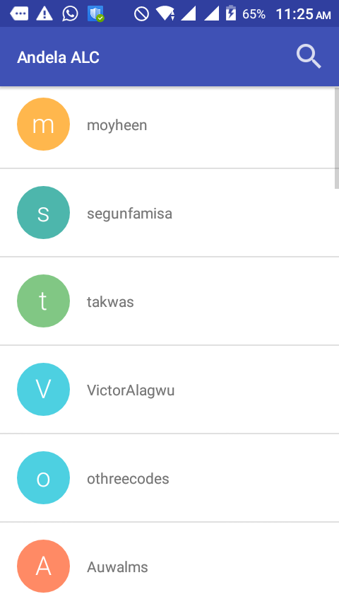
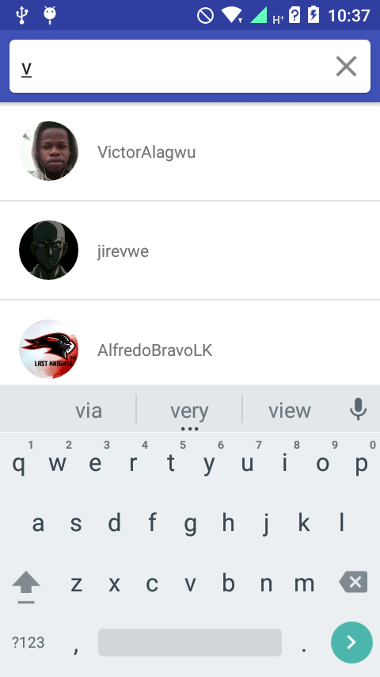
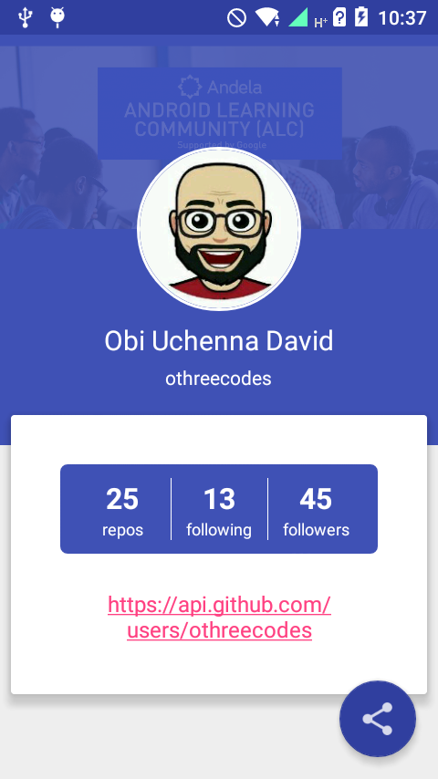
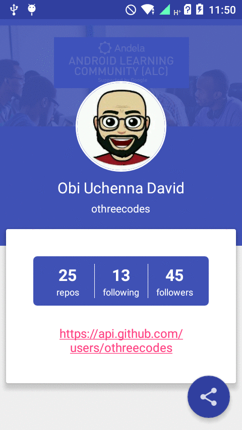

### Status
[](https://travis-ci.org/lethalskillzz/Andela-ALC-Challenge)
[](https://coveralls.io/github/lethalskillzz/Andela-ALC-Challenge?branch=master)


# Andela-ALC-Challenge
Andela Android Learning Community Intermediate Track Challenge


## Objectives

 Build an Android app to retrieve a list of Java Developers in Lagos using the  Github API<br>
 ● Display the list of developers on a list. Each item on the list should have:<br>
 ○ User’s profile image<br>
 ○ User’s GitHub username<br>
 ● Clicking each item on the list should show their profile details.<br>
 ● The profile screen should contain:<br>
 ○ Username<br>
 ○ Profile photo<br>
 ○ Github profile URL<br>
 ○ Button to share their profile, and it should launch a share intent and the<br>
 content of the share should be  “Check out this awesome developer @<github<br>
 username>, <github profile url>.”<br>
 ○ Clicking on the Github url should launch the browser and link to their Github page.<br>

# Screenshots

<p align="center">






</p>  

### Dependencies

Make sure to require Internet permissions in your `AndroidManifest.xml` file:

```gradle
    // support library
    compile 'com.android.support:appcompat-v7:25.0.0'
    compile 'com.android.support:support-v4:25.0.0'
    compile 'com.android.support:design:25.0.0'
    compile 'com.android.support:percent:25.0.0'
    compile 'com.android.support:cardview-v7:25.0.0'

    // retrofit, gson
    compile 'com.google.code.gson:gson:2.6.2'
    compile 'com.squareup.retrofit2:retrofit:2.1.0'
    compile 'com.squareup.retrofit2:converter-gson:2.1.0'
    compile 'com.squareup.retrofit2:adapter-rxjava:2.1.0'

    // okhttp
    compile 'com.squareup.okhttp3:logging-interceptor:3.3.1'

    // RxAndroid
    compile 'io.reactivex:rxandroid:1.2.1'
    compile 'io.reactivex:rxjava:1.1.6'

    // glide
    compile 'com.github.bumptech.glide:glide:3.7.0'

    // Others
    compile 'de.hdodenhof:circleimageview:1.3.0'
    compile 'com.amulyakhare:com.amulyakhare.textdrawable:1.0.1'
```

### Test Coverage

Integration tests.

## License

Copyright 2017 Ibrahim Abdulkadir

Licensed under the Apache License, Version 2.0 (the "License");
you may not use this file except in compliance with the License.
You may obtain a copy of the License at

    http://www.apache.org/licenses/LICENSE-2.0

Unless required by applicable law or agreed to in writing, software
distributed under the License is distributed on an "AS IS" BASIS,
WITHOUT WARRANTIES OR CONDITIONS OF ANY KIND, either express or implied.
See the License for the specific language governing permissions and
limitations under the License.
